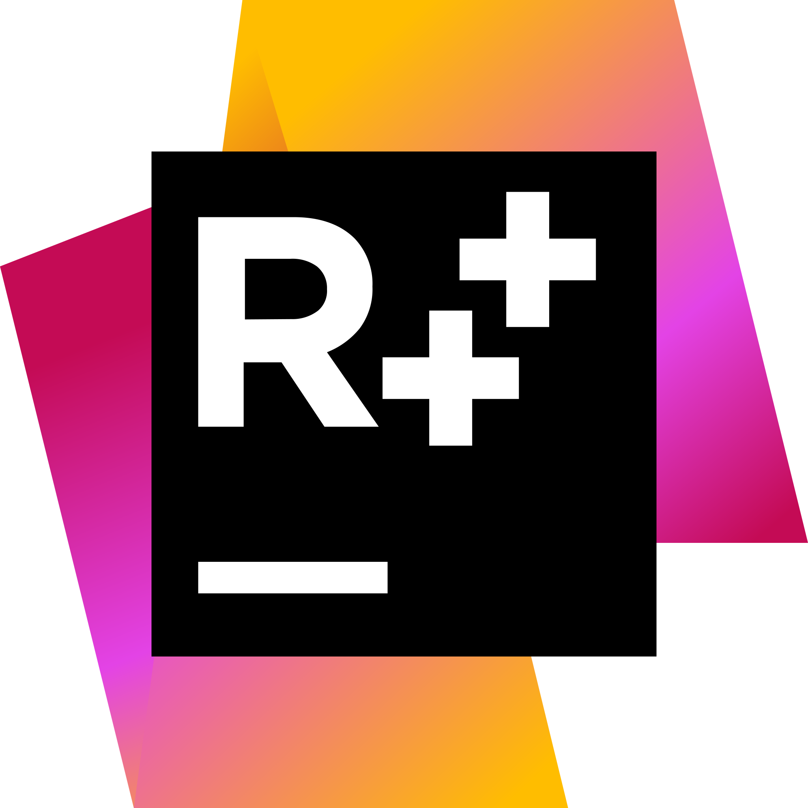

# Привет, друг! 

## 💬 Немного о репозитории:
- 🙌 выкладываю свои университетские лабораторные работы в открытый доступ;
- ✏️ стараюсь активно выкладывать свои учебные наработки;
- 🖥 работаю пока в основном с десктопными и консольными приложениями;

## 📝 Контакты:

[][telegram]
[][gmail]
[][linkedin]

 

### 🎧 Играет в Spotify

## ❗️ Инструменты и языки:

[][windows]
[][visual studio]
[][resharper]
[][cpp]
[][csharp]
[][wpf]
[][github]

 

## ❓ Что хочу выучить:

[][avalonia ui]
[][xamarin]
[][qt]
[][go]
[][d]
[][rust]
[][db]

[telegram]: https://t.me/Chu_Pa_Kabra
[gmail]: rootalfa4@gmail.com
[linkedin]: https://www.linkedin.com/in/alexandr-safiyulin-8453a81b3

[windows]: https://www.microsoft.com/ru-ru/windows
[visual studio]: visualstudio.microsoft.com
[resharper]: https://www.jetbrains.com/resharper
[cpp]: https://isocpp.org
[csharp]: https://docs.microsoft.com/en-us/dotnet/csharp
[wpf]: https://docs.microsoft.com/en-us/visualstudio/designers/getting-started-with-wpf
[github]: https://desktop.github.com

[avalonia ui]: https://avaloniaui.net
[xamarin]: https://docs.microsoft.com/en-us/xamarin/get-started/what-is-xamarin
[qt]: https://www.qt.io
[go]: https://golang.org
[d]: https://dlang.org
[rust]: https://www.rust-lang.org
[db]: https://en.wikipedia.org/wiki/Database
